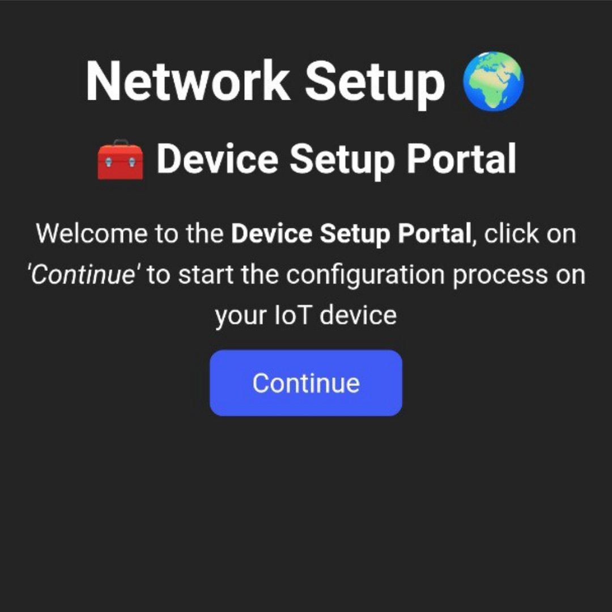
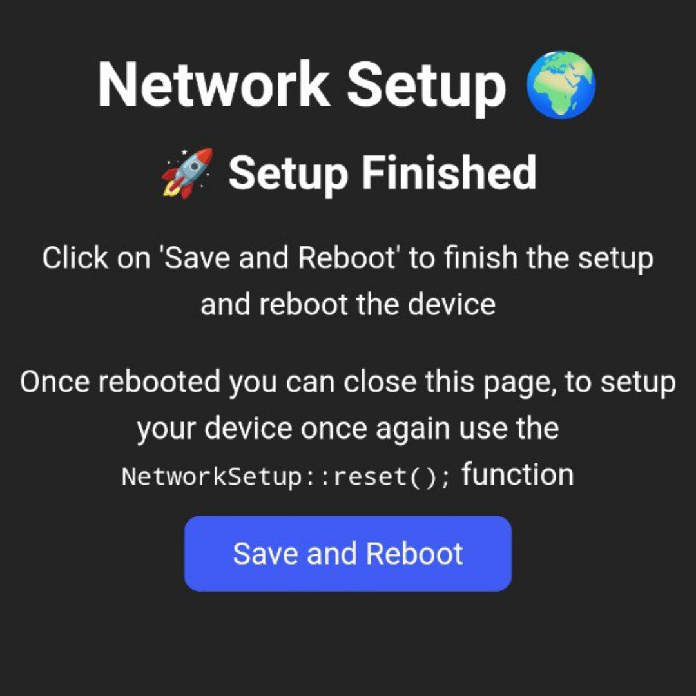
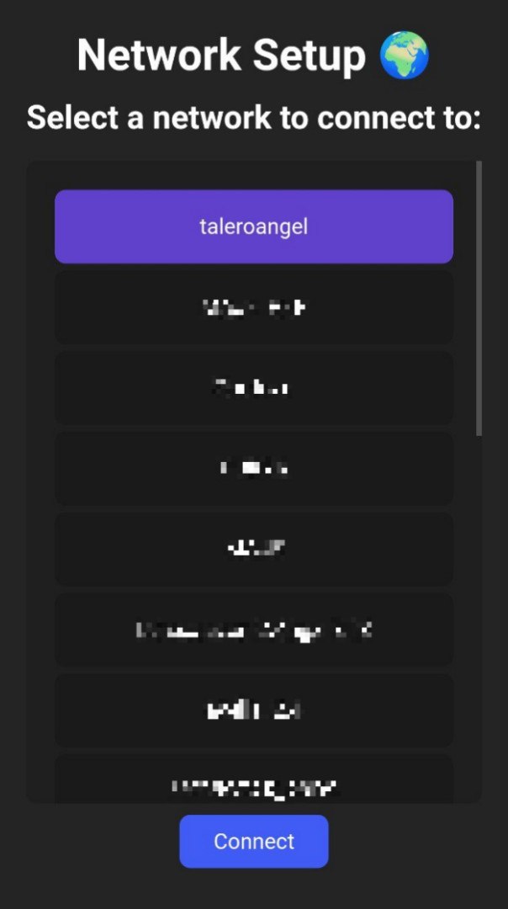
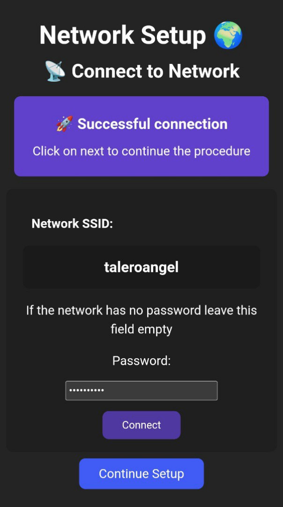
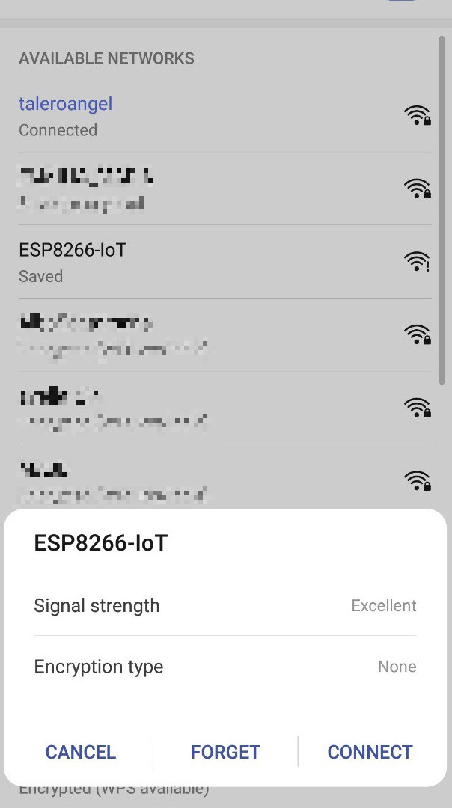
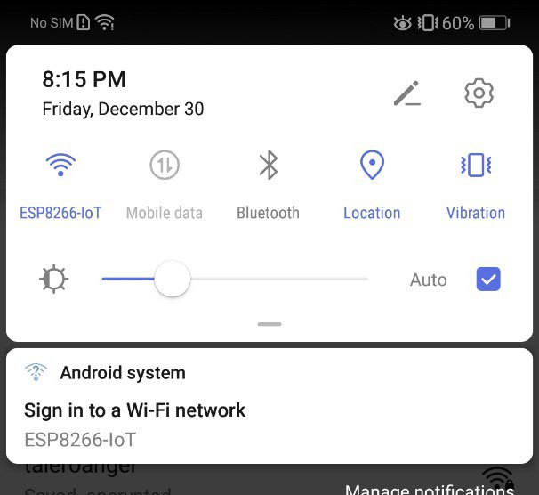
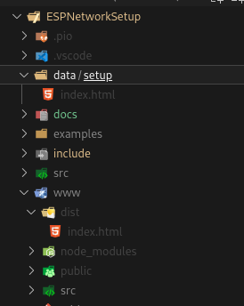

# ESPNetworkSetup 🛠️
ESPNetworkSetup is an Arduino Framework Library for the ESP microcontroller family provided via PlatformIO for managing IoT devices first setup with **vue.js**

It ships with a very basic __WiFi__ selection screen but it is designed to allow easy addition of routes

|                        |                        |
| ---------------------- | ---------------------- |
|   |  |
|  |   |

The ESP device will enter in Access Point, providing a Network to which any device can connect to, this Network will prompt a 'Sign in to Network' page (otherwise known as __Captive Portal__), from here the initial setup will be made, once the user reaches the final page (FINISH_ROUTE), the setup will be stored in flash and further reboots won't prompt the setup portal unless __reset()__ function is used 

| Customizable Network SSID  | Captive Portal (mDNS) |
| -------------------------- | --------------------- |
|  |      |

## Basic usage

```c++
// Include the library
#include <NetworkSetup.hpp>

// Specify the SSID name as the first parameter
NetworkSetup networkSetup{"ESP8266-IoT"};

void setup()
{
	// Start the setup
	networkSetup.begin();
}
```

If you want to check if the device is in setup mode
```c++
// Check if setup is required
if (networkSetup.is_setup()) {
	// Setup is not required ...
} else {
	// Setup is required (automatically handled by the library) ...
}
```
__NOTE:__ Avoid 'while(true)' loops, they will cause errors in the 'Ticker' which provides the network list

##  Routes (Setup Path)
ESPNetworkSetup makes it easy to create a path for the setup process on your IoT devices, the library provides a simple 'WiFi connection mechanism' but you might need different pages such as a 'User login to a backend service' or an 'Additional configurations page'

For adding routes:
Add routes directly into the __AsyncWebServer__ embeded into the __NetworkSetup__ class. _i.e._

```c++
#include <NetworkSetup.hpp>

/**
 * 1. Select the network (Network Select)
 * 2. Finish configuration (Must always be last)
 */
NetworkSetup networkSetup{"ESP8266-IoT", {SELECT_NETWORK_ROUTE, FINISH_ROUTE}};

void setup()
{
	networkSetup.begin();

	// Direct access to the underlying AsyncWebServer
	networkSetup.server.on("/example/foo", [](AsyncWebServerRequest *request) {
		request->send(200, "Hello World!");
	});
}

```

Direct access to the underlying _AsyncWebServer_ is great for defining additional API's.

### 'next' route
The setup process is excepted to be linear (the configuration process is done step by step) an thus you need to define the order in which these pages are shown.

The library provides two __MANDATORY__ routes:
* SELECT_NETWORK_ROUTE: WiFi selection page (allows WiFi connections)
* FINISH_ROUTE: (Save and store the configuration, must be the last route)

Routes are defined as the second parameter of the constructor:

```c++
NetworkSetup networkSetup{"ESP8266-IoT", {SELECT_NETWORK_ROUTE, FINISH_ROUTE}};
```
Accesing this routes is done through an __special route__:
- _/setup/next_

This routes automatically redirects the user to the next item into the routes list provided, 

#### Adding your own routes
When creating an additional page in the __vue.js__ framework first define the route in the __vue_router__, then add an entry to the _'route'_ parameter in the __NetworkSetup__ constructor

```c++
NetworkSetup networkSetup{"ESP8266-IoT",
{
	SELECT_NETWORK_ROUTE,
	[](AsyncWebServerRequest *request) {
		// Redirect to the 'vue-route' route
		request->redirect(F("/some/route"));
	},
	FINISH_ROUTE,
}};
```

## Compiling the webpage
1. Download the 'www' folder and copy it in the root of your project
2. From the 'www' folder: open a terminal and use ```npm run build``` for compiling your 'vue.js' web page
3. Create a new folder in the root of your project called _'data'_, create another folder inside 'data' called _'setup'_
4. Copy the 'index.html' file from _'www/dist'_ (or create a soft symbolic link) to _'data/setup'_

Folder structure should look like this:



5. Build and upload the __Filesystem Image__ from the PIO menu

## 🚧 Caveats
* EEPROM Dependency

* Tickers: a 5s ticker has the responsability of providing the network list, calling the WiFi.scanNetworks() function directly from the HTTP Servers throws exception(29) and thus while(true) loops can't be used, even when yield() is used because Tickers won't be executed

* __50% Flash and RAM usage:__\
  problably related to _ArduinoJson_ and _AsyncWebServer_ libraries so if your sketch is already using them memory usage won't be meaningfully affected, but larger sketches probably won't fit alongside the library

* __['next route'](#next-route) on multiple devices__:\
  Because ['next route'](#next-route) pointer is incremented every time the route is fetched; when connecting multiple devices routes won't show as expected